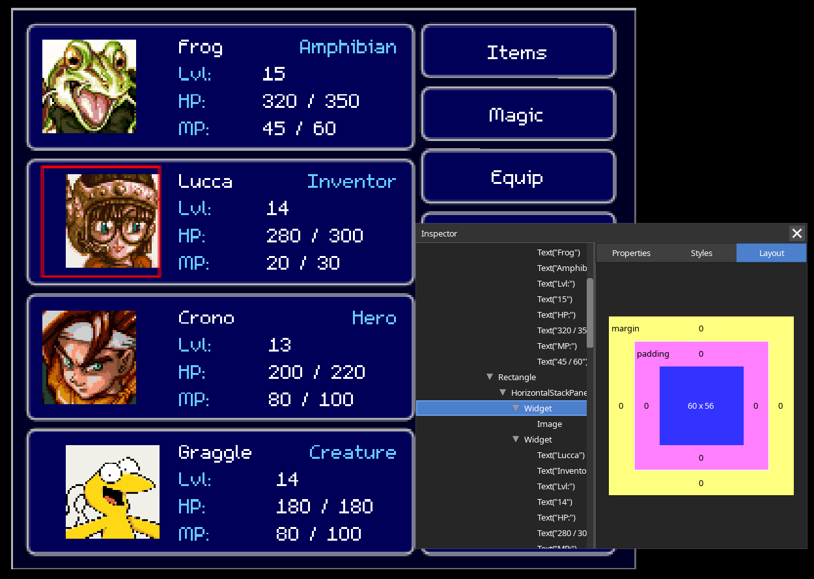

# ennui
> [!CAUTION]
> This is still in development - I will break stuff.
> Documentation is very thin but there are plenty of [examples](examples).

A retained-mode UI library for [LOVE](https://love2d.org/).

## Hello button
```lua
local ennui = require("lib.ennui")
local TextButton = require("lib.ennui.widgets.textbutton")

local clicks = 0

local host = ennui.Host()
local button = TextButton("Click me!")
    :setSize(400, 300)
    :setPosition(100, 100)
    :onClick(function(button, event)
        clicks = clicks + 1
        button:setText(("Clicked %d times"):format(clicks))
    end)

host:addChild(button)
```

<video src="https://github.com/user-attachments/assets/627331e2-f72e-48f8-9d86-a7bbbd9e0d92"></video>

## Inspector
